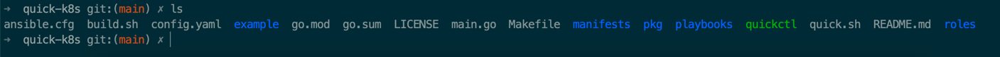

# quick-k8s
使用kubeadm 快速创建集群

先决条件:

1. 虚拟机需要安装ansible

## quick start

前置安装
```bash
# centos
yum install -y centos-release-ansible-29.noarch ansible git wget

```


1. 下载并安装`quickctl`
```bash
bash <(curl -s -S -L https://raw.githubusercontent.com/clarechu/quick-k8s/main/quick.sh)
```

2. 查看文件

```bash
$ cd /etc/quick-k8s
```

查看当前目录的文件如下:



## 安装k8s 集群

1. 创建一个新的集群,选择 `new`

```bash
$  ./quickctl cluster demo
 Use the arrow keys to navigate: ↓ ↑ → ←
? Select step:
  ▸ new
    clean
    prepare
    runtime
↓   kubernetes-master
```

2. 设置hosts文件来准备你的集群

```bash
# 进入 当前的cluster/<CLUSTER_NAME> 目录

$ cd cluster/demo
# 设置hosts文件

$ vim 设置hosts文件
```

```yaml
# 'etcd' cluster should have odd member(s) (1,3,5,...)
[etcd]
172.21.33.70 ansible_ssh_user=root

# master node(s)
[kube_master]
172.21.33.70 ansible_ssh_user=root

# 同步时间 set ntp server
[chrony]

# work node(s)
[kube_node]
# 172.21.33.79 ansible_ssh_user=root

```

3. 开始安装

```bash

# 选择步骤 setup
$ ./quickctl cluster demo


```